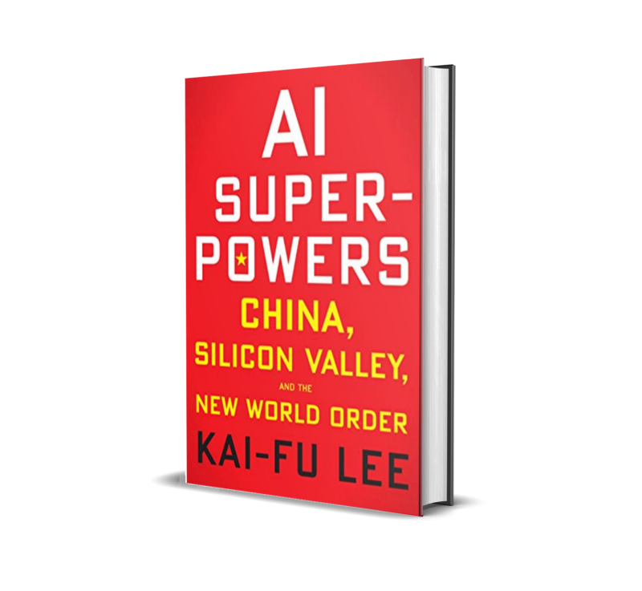
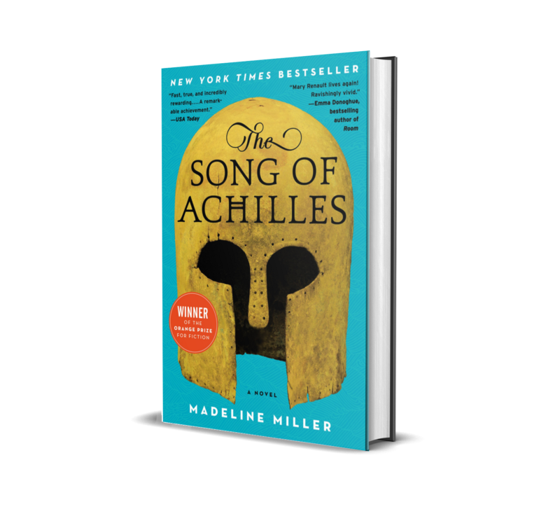
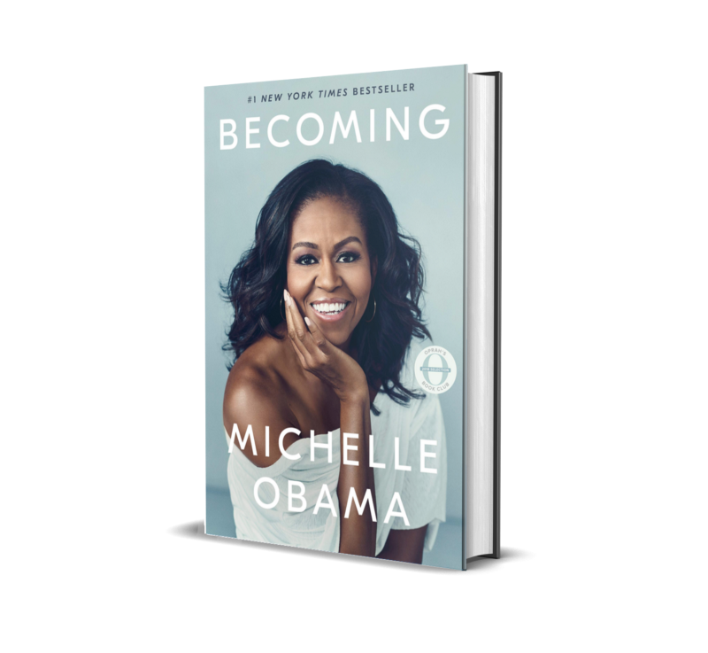
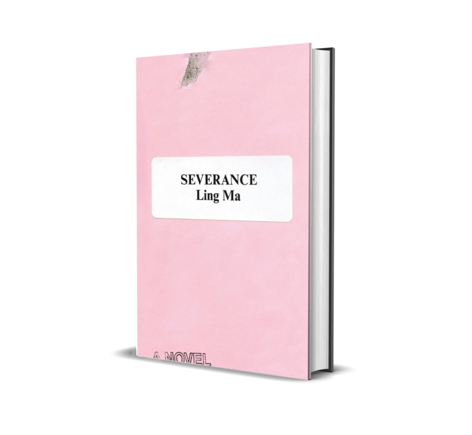

In an attempt to actually follow through my "one book per week" goal, a goal that I've been trying to reach since 2015, I plan to document what I read every month with short blurbs summarizing what I've learned from them or simply emotions that they stirred in me. I try not to be too obsessed with ratings and recommendations when it comes to books, not like how I am with movies, TV shows, or music, because I believe even books that I hate to my core can show me a new way of seeing things. The habit of reading books, either physical or digital, have added the most value to my life, sometimes in the most unexpected ways. I'll expand on that later on in this blog if I miraculously keep it up this year. But for now here are the books that I've read (now two months late) last January.

---

## Week 1: January 1–6
# AI Superpowers: China, Silicon Valley, and the New World Order (Kai-Fu Lee) [Non-Fiction]

> "While Socrates encouraged his students to seek truth by questioning everything, ancient Chinese philosophers counseled people to follow the rituals of sages from the ancient past. Rigorous copying of perfection was seen as the route to true mastery."

There's a barrage of China articles on my feed not just from news outlets like [The New York Times](https://www.nytimes.com/2018/12/21/books/do-you-want-to-read-more-about-china.html) but also tech magazines like [MIT Technology Review](https://www.technologyreview.com/magazine/2019/01/) and Wired. It is not without precedent, given advances in China like the [CRISPR twins](https://en.wikipedia.org/wiki/Lulu_and_Nana_controversy), launching the most number of [rockets](https://www.technologyreview.com/s/612595/china-launched-more-rockets-into-orbit-in-2018-than-any-other-country/) in 2018, and as its standing as the only worthy competition of the US in the field of Artificial Intelligence. For the latter, it's easy to get swept away by how Western media covers it, focusing mainly on ideas along the lines of privacy and the emergence of an AI war. So it's calming to read about this new "impending threat to humanity" from the perspective of someone who is part of both countries' inevitable rise as the world's leading AI Superpowers. 

The book starts strong by shedding light to how the Chinese see technology and the world at large including the minutiae of the Chinese government's handling of this newfound stronghold. Kai-Fu Lee's inside knowledge steers the conversation away from shallow pronouncements and stereotypes, like a prevailing joke that the Chinese are nothing more but "copycats", which is only funny if you watch shows like _Silicon Valley_. Although not unfounded and is technically rooted in truth, it takes on a more nuanced outlook through the lens of someone who is in the midst of it. However, the book does falter towards the end, with the author essentially shoving _love_ down our throats as a viable solution to suppress an AI war (not exaggerating here, he literally mentions "love" three times). But albeit off track and distractingly soft compared to what came before it, the motivation is undoubtedly pure. It probably says a lot more about us who scoff at the idea that banking on our better selves gives birth to a better future. Maybe it's time we stop rolling our eyes and start listening to the experts and to each other.

---

## Week 2: January 7–13
# The Song of Achilles (Madeline Miller) [Fiction]

> "He said what he meant; he was puzzled if you did not. Some people might have mistaken this for simplicity. But is it not a sort of genius to cut always to the heart?"

When I was a freshman in college, I had to prepare a presentation on a few parts of Homer's _Iliad_ for my world literature class. It wasn't the first time that I had to read the epic for school, it also being a required reading in 7th grade. But it was the first time that I had Wikipedia and the first time that I encountered the interpretation that Patroclus and Achilles had a deeper relationship than what was presented to me by my high school teacher and the 2004 film adaptation _Troy_. I remember spending more than half of the allotted presentation time discussing how the relationship should be rightfully perceived - was it _paiderasteia_ or just simply same-sex love - not realizing that I was projecting my own conflicted sexual desires in the process to an audience consisted primarily of political science majors (I was an engineering student) and my horrified English professor. 

A decade later and a few years after I've accepted that I too identify as non-binary (duh), I meet a book with the love between Patroclus and Achilles in full view, with all the romance and hope that a coming-of-age novel promises. I can't help but feel sad that I didn't have it as a teenager, but reading it gave me more than the cathartic vindication I wanted to have: it felt like a familiar melody that I carried with me all along.

---

## Week 3: January 14–20
# Becoming (Michelle Obama) [Non-Fiction]

 
> "It was one thing to get yourself out of a stuck place, I realized. It was another thing entirely to try and get the place itself unstuck."

Who knew that a lower middle class Filipino boy, raised by a single mom in a town 6 hours away from Manila, could find a lot in common with the only black first lady of the United States of America? It speaks volumes to how most of our experiences, even the most terribly specific or those that are seemingly innocuous, transcends the borders that we unknowingly put up between ourselves. It's also possible that I just think too highly of myself. But sometimes it's our unprecedented notions of the kind of people that we are that propels us to become something more than what our unchosen (and oftentimes suffocating) circumstances could've dictated. The small privilege _that_ choice can bring is liberating, but to show the world that they have that choice too is its own reward.

---

## Week 4: January 21–27
# Severance (Ling Ma) [Fiction]

I only just recently realized that the books that have influenced my life the most are the few books that I've read by authors of Asian descent. The list includes: _A Little Life_ (Hanya Yanagihara), _Private Citizens_ (Tony Tullathimute), The _Remembrance of Earth's Past_ Trilogy (Cixin Liu), _Pachinko_ (Min Jin Lee), and the collected works of science fiction writers Ken Liu and Ted Chiang. Not to mention Fumio Sasaki's _Goodbye, Things_ which I read last year in an uncharacteristic turn of actually picking up a self-help book. For a Filipino who unabashedly thinks that he is educated like an American, speaks like an American, and even jokes on Reddit like an American, this realization was mind-blowing and a hard slap on the face. 

Like the protagonist of Ling Ma's _Severance_ I too had high regard for the romance and glamour of New York (and consequently, America), never having set foot in it and yet fed by the media that I consume that I should. Now that I am aware of how conditioned I am to uphold Western institutions and ideals, ignoring and even belittling the Eastern values that are better representations of my upbringing, I felt detached reading this book early on. I read it on flights to and from Bali, wanting but never getting over the disgust of reading about a character obsessed with her individual well-being over her community's and has a lazy relationship with globalization even though she's in the midst of it - tenets of an Asian too American to care. Maybe that's the point the author was trying to make, to see myself in the character and try to steer my life the other way. I just wish I remembered how it ends.