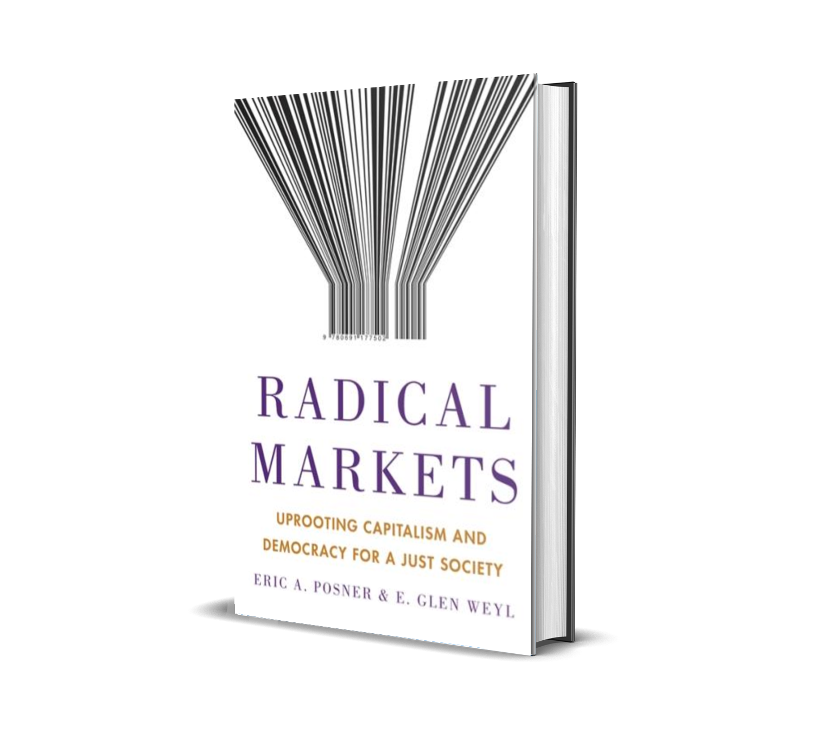
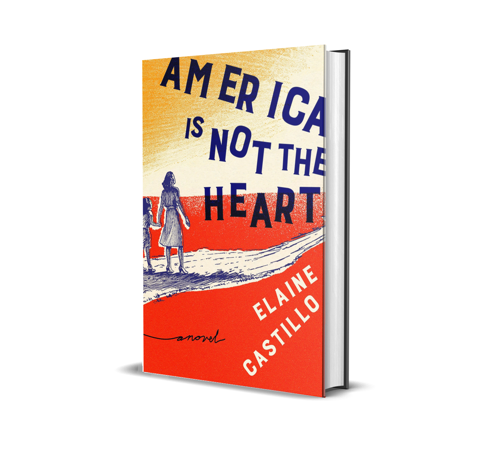
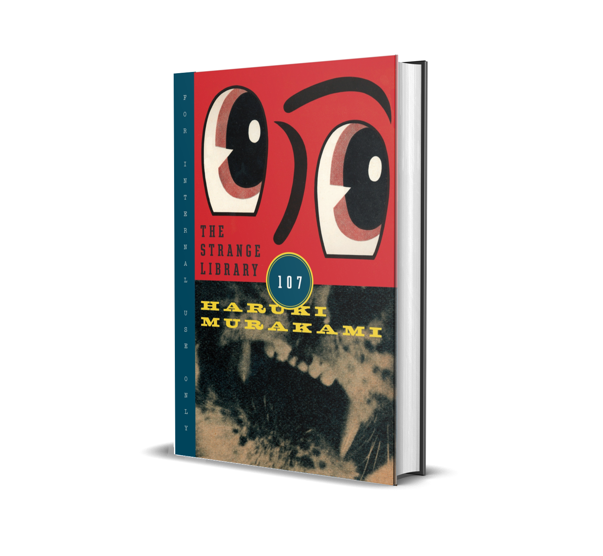
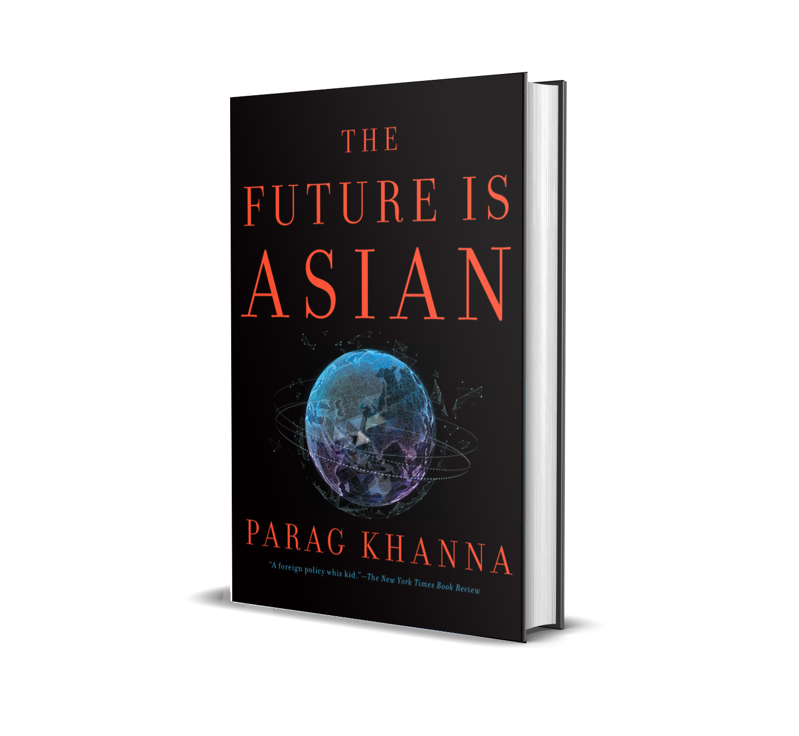
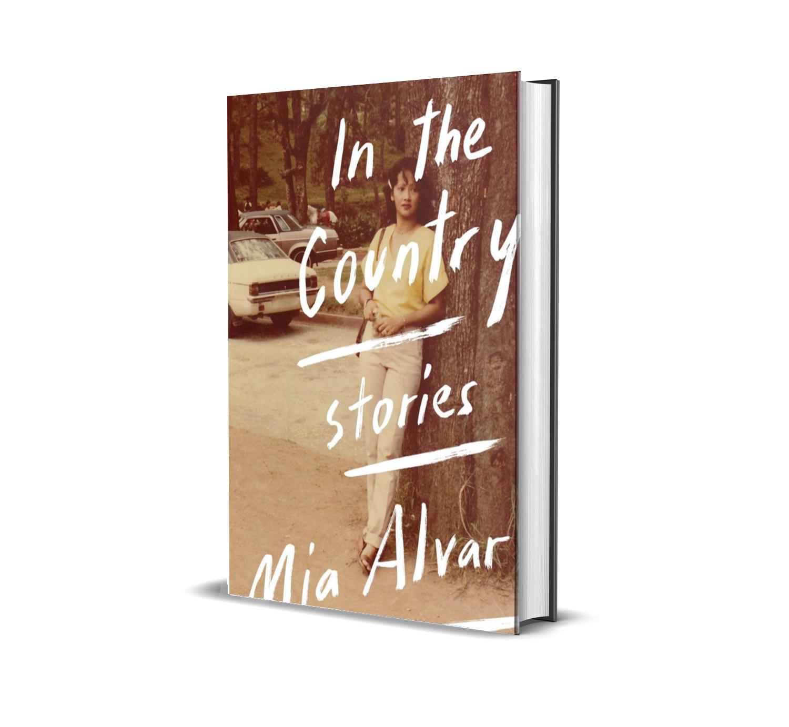

I set out this year not just to try to read more books but specifically to read more books by Asians. The desire came to me when I was in Bangkok for the new year with my family. While I was there, I had the chance to reflect on the year before which I consider to be the best year of my life yet. I've traveled to more countries than I thought I would at 25. I've seen famous landmarks like the Eiffel Tower, the Sagrada Familia, the Colosseum, and the Sistine Chapel. I almost got hit by bicycles in Amsterdam and by motorcyles in Hanoi. I've experienced the crazy weather in Melbourne and got to party with locals in Barcelona. All of that in a year, only because I'm lucky enough to find a job in Singapore and earn enough to not think about money anymore. But even though all of that was fun and I thoroughly enjoyed it, I realized that I'm happiest when I'm in Southeast Asia.

Looking the way I look, I've been thought of as Khmer in Cambodia, Thai in Bangkok, Balinese in Bali, and Malay in Singapore. I could take that as an offense and say that it sucks to be ethnically ambiguous. But I take it as an opportunity to smile and converse, clarifying that I'm proudly Filipino. That usually gets me something along the lines of, "Oh! I've heard about your president!", which steels me up to try and not spew out vicious attacks because I'm more scared to lose a connection than to be seen as an ally of the wrong side.

I did not plan this out but the books that I read for February are in line with these reflections. All except for one are by Asians. Two of them are even written by _kababayans_. I thoroughly enjoyed them all that I kind of [don't want to read white people fiction](https://lithub.com/the-year-i-stopped-reading-white-people/) ever again. I meaan I say that as a joke, but it probably wouldn't hurt.

---

## Week 5: January 28 - February 3
# Radical Markets: Uprooting Capitalism and Democracy for a Just Society (Eric Glen Weyl and Eric A. Posner) [Non-Fiction]

As much as it is fashionable today to hate on Privileged White Men, there is something about the "radical" confidence that they bring out into the world that you can't help but want to emulate. Of course this confidence is from that aforementioned privilege, but sometimes it gives birth to an innovative idea or a piece of technology that democratizes access and extends it to those who don't have boot loads of money and those that do not have the same head start in life. In the end it doesn't matter what the motivation was and to deny it the respect wouldn't be fair. In Eric Glen Weyl and Eric A. Posner's book _Radical Markets: Uprooting Capitalism and Democracy for a Just Society_, it's in the title that they are at least intrinsically motivated to help.

I'm no economist and I'm not going to pretend that I understood the entirety of this book. A part that stood out to me, however, is the third chapter called "Uniting The World's Workers" which presents the idea of immigration as a way to boost wealth not only of the immigrants and the countries that they migrate to, but also the countries that they left. As someone who works on an Employment Pass in a country that is not the same as the one in my passport, it's pretty obvious why. I wholeheartedly encourage this, having seen for myself how being immersed in a diverse array of cultures in the workplace works wonders. I long for a world where we can all call ourselves global citizens and in turn can collectively call this planet home.

I do, however, disagree with some of the ideas laid out in the rest of the book. Paying people for their data might hinder our progress in machine learning and artificial intelligence. I have questions about how you're going to go about that if we can't even regulate it. I would like to read more studies and see more quantitative analysis on Quadratic Voting to be convinced. But the thing is, disagreeing about these ideas is the whole point - to radically change how you think, pursuing ideas with ruthless abandon about the consequences, and feeling like you have all the agency in the world. That's how White Men operated since they were our colonizers and we were all their _indios_. It's easy to forget that either intentionally or not, they have now given us that access too.

---

## Week 6: February 4–10
# America Is Not The Heart (Elaine Castillo) [Fiction]

It's been [widely discussed](https://sloanreview.mit.edu/article/using-artificial-intelligence-to-promote-diversity/) that diversity and representation is an important point that we need to take into account as we progress as a species. In the past few years we've seen films like _Black Panther_, _Crazy Rich Asians_, _Moonlight_, and _Wonder Woman_ show the value of telling stories from underrepresented communities. Not just profit-wise for the corporations that chuck them out, but more importantly as evidence that there are people waiting to hear them to be told.

However, it is not until I read Elaine Castillo's _America Is Not The Heart_ did I feel like I was being seen. I don't read much Filipino authors to be honest, succumbing to my bias that all of their novels has to either involve a national hero, tell the lives of Filipino immigrants and OFWs, or live in the time of martial law. As if to prove my point, Castillo's book satisfies two of those. The main character is a student activist who got tortured during the reign of Marcos by being part of the "communist" militia as their in-house doctor. She got pardoned later on only because of her family's ties to the ruling family and eventually migrated to the United States where she contemplated her past. In other words, it's Basic Filipino Shit.

But banking on the fact that the high school I went to was mentioned in the prologue by name, that it code switches casually from English to Tagalog to Pangasinan to Ilokano which are languages that I speak and understand, that it frequently mentions food that I don't have to google, and that the main character isn't even straight, I was immediately hooked. In internet slang, it's an "OMG ME" moment, a moment rare enough that like a true millennial I posted it on Instagram _twice_. It's pretty ironic that I came across this book while I was browsing lists of 2018's best books from US publications. But if this is what representation feels like, please, give me more of that _pansit_.

---

## Week 7: February 11–17
# The Strange Library (Haruki Murakami) [Fiction]

I cheated this week because Haruki Murakami's _The Strange Library_ is technically a short story packaged as an illustrated book. But since I was also down with the flu, I decided to forgive myself by counting it as my book for the week instead of calling this year a failure and dropping my one book per week goal altogether. It is not often that I'm that forgiving. I'm the kind of person who likes to remind himself that he's a piece of shit. As much as I would like to review this "book" thoroughly either by saying a bigger horror is that my country doesn't have a decent library, or by going deep into how I prefer my magical realism with a bit of humanity (a feat that Murakami can do very well when he's into it), it really is just best explained as one of the author's many fever dreams. Who knows, maybe it was mine too.

---

## Week 8: February 18–24
# The Future Is Asian: Commerce, Conflict, and Culture in the 21st Century (Parag Khanna) [Non-Fiction]

> "Being self-correcting is more important than being correct in any one thing."

The Philippines was a United States territory in 1898–1946 in which time the Americans were in charge of providing education to the country. But it is not until I left that I saw how huge the impact is of this bequeathal in shaping the country's culture. It dictated the media we consume and the trends that we follow, influenced our treatment of politics as celebrity and vice-versa, charted our personal goals and career paths, and injected our undying dedication to the tenets of democracy which in turn defined what constitutes as "progressive". You notice it in the way we talk and even our sense of humor.

Today, especially because of a [recent turn of events](https://www.rappler.com/newsbreak/in-depth/226728-provisions-waivers-philippines-loan-agreements-with-china) (or proliferation of propaganda), Filipinos have become hostile to all things that has a connection to China. Although not unfounded and the alertness should be maintained, I'm starting to think that it's possible that the hostility and the misguided animosity that we cultivated over the years is also largely inspired by American resentment. Parag Khanna's book gives an alternative view of China's modern strategies like the [Belt and Road Initiative](https://www.worldbank.org/en/topic/regional-integration/brief/belt-and-road-initiative), pointing out that China is better off allowing its neighboring countries to grow on their own terms instead of colonizing them or acting as a benevolent leader. He provides undeniable historical evidences that Asian nations wouldn't allow China to do that anyway, but friendly cooperation and joint development is a more sustainable alternative to modern slavery provided by Western-initiated globalization. The book starts confidently with a chapter called "A History of the World: An Asian View", a dizzying crash course on world history eschewing Western-centric narration of events. It builds on this premise and gives the reader an Eastern point-of-view, a voice that has been strategically erased in popular culture and international discussions even if it is a voice of five billion people.

Compared to a sense of helplessness from books like [Acemoglu and Robinson's _Why Nations Fail_](https://www.amazon.com/Why-Nations-Fail-Origins-Prosperity/dp/0307719227) and its theories of unescapable vicious and virtuous circles, reading it felt both like a rebuke and a breath of fresh air, the way an honest negative feedback from a friend simultaneously hurts and inspires. It envisions and presents a strong case for harmony as a driver of growth - a satisfying balm to the groans of the privileged. It's a call to arms to build a better world declaring that it's as simple as looking to the person next to you. It is in its purest form a book on sound foreign policy. That doesn't mean it can't also make you cry.

---

## Week 9: February 25 - March 3
# In The Country (Mia Alvar) [Fiction]

As an Overseas Filipino Worker (OFW) myself, I delayed reading this book because I was afraid that it would force me back home by identifying too well with the stories inside. Like _America Is Not The Heart_, I have a basic idea of what was going to be laid out by just reading the book's blurb on Amazon. I expected it to be nauseatingly sentimental the way all OFW stories are, and that for better or worse I am actually a sucker of. I imagined myself reading this on a flight or at the airport, unapologetically crying by seeing the events happen in real life after I read them. Instead, I read it in my bedroom at night before going to bed, borrowing a copy from the Singapore public library. I did not cry as much as I thought I would, but I understood.

In the same way that the web series and later HBO show [_High Maintenance_](https://www.hbo.com/high-maintenance) gave nuance to stories of people who use weed, Mia Alvar's _In The Country_ is a collection of stories of Filipinos or those who interact with Filipinos by exploring what it means to belong. It has stories from the perspective of: an American model who occasionally books jobs in the Philippines; a group of Filipino women in Bahrain and their tendency to live off of gossip and slander instead of empathy (maybe because they wouldn't know the difference); a private teacher for a child with special needs and her interactions with the child's rich mother; and even a vignette of an imagined life of the Aquino family before Ninoy's assassination presenting a calm before the storm as ordinary as preparing for the next typhoon. Alvar's prose is so vivid that you forget that this is a work of fiction. Instead of opting for the usual tidy stories that patronizes these experiences, these stories show what Filipinos really are: a bit judgmental at times, overly cliquish and passive-agressively racist, but almost always undying to the families that they left back home. The stories don't glamorize the idea of leaving the country for greener pastures, neither do they punish those who would think that it's the only way to be free. It does not preach or condemn, its only goal is to _tell_. It's a naked portrait of Filipinos with all our imperfections. As if to say, yes, we're like you, because simply saying it wouldn't suffice.

I don't know if it eventually did convince me to pack my bags and go back. I know it would be a crappy homecoming if I return to the Philippines without bringing with me an idea to help it move forward. I lay awake at night mulling over my ineptitude and the privilege and luck I don't deserve, carrying it with me like an OFW's _balikbayan_ box everywhere I go. Sometimes, I really just miss home.

