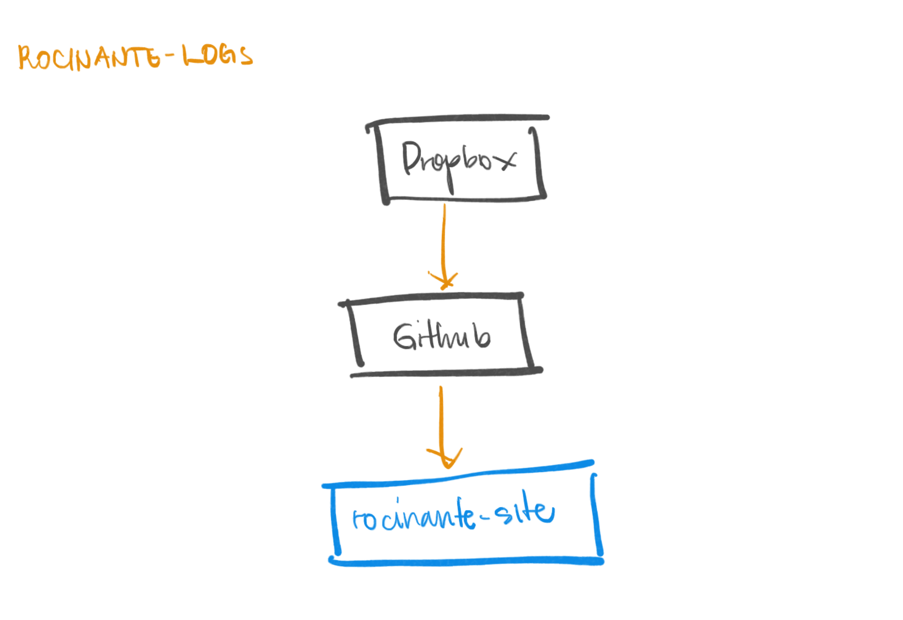
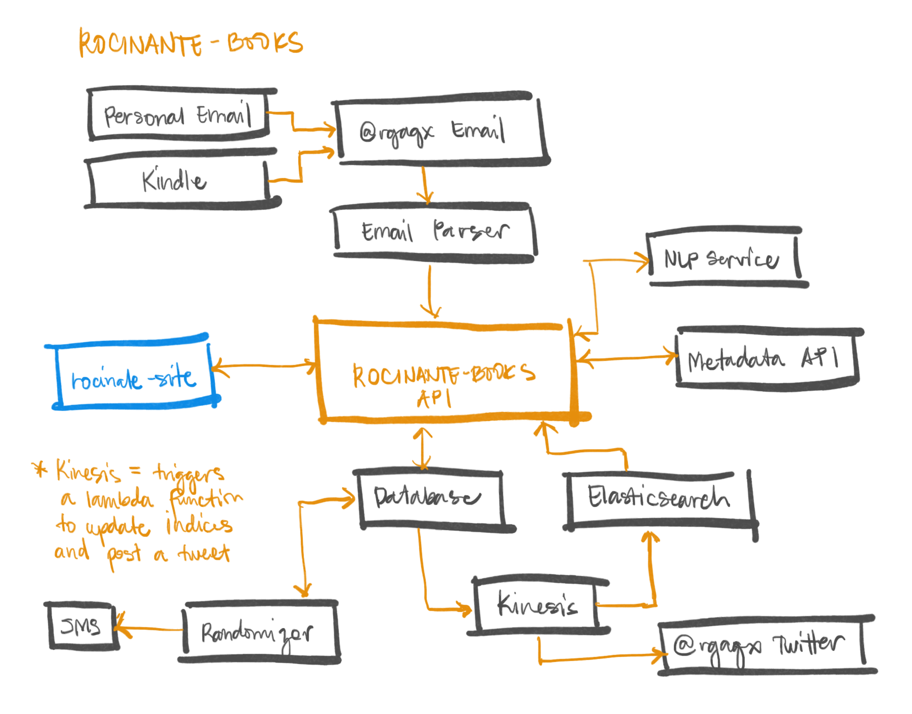
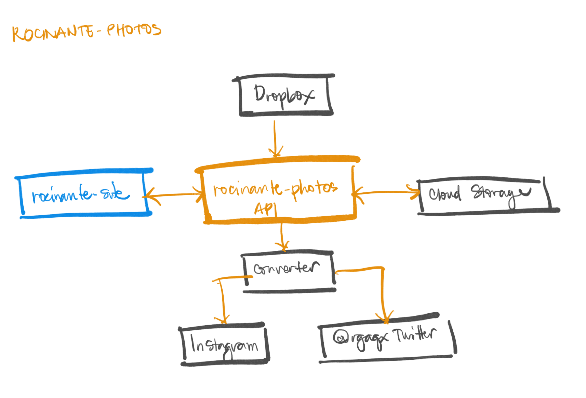

**The Rocinante Project** aims to create a personal command center for my digital life. I call it a command center to make is sound cool, but in essence it really is just an over-engineered profile page. Professionally, it aims to be a showcase of what I can do as a web developer and as an observation of what I can’t.

## Background and Objectives

This project started because I wanted to have all of my interests and vanities to be in one domain. It’s exhausting to have to keep up an account on Facebook, Instagram, Twitter, Last.FM, Letterboxd, Goodreads, Medium, etc. But more importantly, I wanted to decouple my life from these platforms because they slowly tend to erase our differences. Our travel and baby photos, late night tweets, the music we cry to on the train, the books that inspire us, these are shards of our soul that are now lifelessly considered mere data.

The project is modular by design, which can be mixed and matched, and should allow easy integration on other people’s personal websites based on their own set of vanities. The loftier objective is for people to own their content again and to be able to provide a way of presenting themselves to the world (and to the future) without needing to follow strict guidelines set by others.

This is also a way for me to learn new web development technologies that I’m not familiar with. There can only be so much tech that you can use in a company either if it’s a startup or a huge multinational corporation and yet the tech world grows so fast. It’s easy to get demotivated when you are in this field because you are always surrounded by people who are smarter than you. But it can also be really fun, especially when you commit to it and approach it with an earnest desire to learn.

## What’s up with the name?

The name _Rocinante_ is originally from Miguel de Cervantes’ _Don Quixote_, a book that I unfortunately haven’t read yet. According to [Wikipedia](https://en.wikipedia.org/wiki/Rocinante) it’s the name of Don Quixote’s work horse, who “is awkward, past his prime, and engaged in a task beyond his capacities”. My usage is from _The Expanse_, a TV Show based on the series of science fiction novels by James S.A. Corey (pen name for Daniel Abraham and Ty Frank) that used the name as a nod to the same horse. The [_Rocinante_](<https://expanse.fandom.com/wiki/Rocinante_(TV)>) (or _Roci_ for short) is a “Corvette-class light frigate with multiple roles, such as torpedo bomber and boarding party insertion”. In other words, it’s a swiss army knife but SPACE built using the latest of Martian tech. It also has a diverse set of crew members not unlike _Star Trek_. Either way the name is poetic enough to discount the fact that I’ve only read up to _Caliban’s War_. And to keep up with the theme, any tiny utility built for the _Rocinante_ project will be part of the accompanying _Somnambulist_ project. I won’t say why for that one to avoid spoilers in case you’re interested to watch.

## Guiding Principles

1. **Everything is open-source.** This is both for transparency’s sake and for general availability to the wider dev community. I don’t intend to make money out of this project, I’d rather have someone else using them or learning from them. For me the learning is its own reward. Anything that comes out of this project is allowed to be reused in any form. (Except of course the blog posts. You should paraphrase to make it your own.)
2. **Every module or utility should be standalone and have no circular dependencies.** I got used to working on apps that have a monolithic structure using an object-oriented language with classes that don’t isolate responsibilities very well, so it’s hard to remove the mental models it gave me out of my system. To continue training my brain to think differently, every utility and even the larger modules that use them should be easily replaceable, be independent from each other, and have their responsibilities be well defined. They should be microservices or be serverless functions. Inside the code, composition over inheritance (i.e has-a instead of is-a) is favoured, even when a strictly object-oriented language is used.
3. **It’s an unapologetically polyglot Rube Goldberg machine.** Since one of the motivations for this project is to learn new things, a variety of languages will be used for the backend and they will be hosted on different platforms. It would be cleaner to put them all in one place using one language but that wouldn’t make it fun, and the breadth of options out there were introduced because they intend to solve specific use cases. It’s a way to explore the different stacks and platforms available to help me make informed design and architectural decisions at work. The variety also encourages productivity because I can switch back and forth if I'm getting bored or I’m stuck on one stack.
4. **Keep the stakes low.** Because this is a personal project with no one else depending on it (yet), I can deploy as much as I want to and break it sometimes. The low stakes allow creativity by removing the need to always push perfect code or someone blaming me if I break production.
5. **Always be blogging.** Undocumented dev projects are the worst and yet I never do it often myself. I found that the most efficient way to do something I _know_ I should be doing but I’m not motivated enough to is to introduce it as a habit. The goal is to be prolific enough that it becomes automatic. Telling a narrative as I design also clears my head and provides structure to my thoughts.

## Hello, @rgaqx!

**@rgaqx** is my personal AI / robot alter-ego to manage all communications between the different pods. I want all system communications to be separate from my personal data. @rgaqx will handle anything that does not require human intervention. To start it off he will have his own Twitter, Github, and Instagram. All email communications are branched out to him from my email address by using an email alias (i.e. ralphgregoraquino+ai@gmail.com). Receiving anything from @rgaqx should be considered as an automated response unless stated otherwise.

## The Pods

The project is divided into separate modules called **pods** that can be worked on in parallel. These are independent of each other and can be attached or removed easily. The first four are those that I would start now and have at least a working prototype by the end of 2019. The others are examples of what further extensions can be made.

### [RS] rocinante-site

The parent pod. It’s a static website that presents the different submodules’ resources (i.e. it’s a frontend for all of the backend services). I could break the different sections up later to allow others to easily integrate them on their own websites, but for now they will all live on the same repository as their own page.

It’s my way to learn frontend development without going into too many details, that’s why I’m using Gatsby instead of creating it from scratch. It can also help me exercise graphics and UI/UX design since I’ve never done it professionally, only for publicity materials back when I was in university. If there’s an npm package for something that I want to do (e.g. I want the landing page to be scrolling full screen pages or I want a responsive grid using React components) I’d use it instead of building one myself.

**Target Stack**: Gatsby (React + GraphQL), Netlify

### [RL] rocinante-logs

A blog chronicling the development of the project. It also includes posts about my other interests as a way to put them all in one place. I don’t own social media accounts aside from Instagram so my thoughts can live here. It’s tightly coupled with _rocinante-site_ for now unless I care to create it as its own Gatsby starter. It's the simplest of all the pods as it only requires markdown files and the accompanying assets to be uploaded automatically after dropping them on a folder in a file hosting service (e.g. Dropbox).

I also don’t know how to do technical writing. As a side effect of reading too much fiction, I use too many modifiers. You probably noticed that by reading this post. I’m a guy who joined a regional writing competition in high school with the task of profiling Manny Pacquiao and I ended up with a piece with two paragraphs about his sweat. I want to know how to write concise technical documents that are straight to the point (i.e. user manual not prose).

**Target Stack**: Gatsby (React + GraphQL), Netlify, Dropbox API

### [RB] rocinante-books

This [Medium post by Sawyer Hollenshead](https://link.medium.com/HZTAXH6NuZ) and [Nat Eliason’s published book notes](https://www.nateliason.com/notes) are really what inspired me to kick off the entire project. I wanted for myself a repository of all my book notes (both digital and by hand) that is easily searchable and mimics features of [Readwise](https://readwise.io). I also just don’t like [Goodreads](https://goodreads.com).

Copying Sawyer’s implementation, I aim to make this pod to be fully serverless and be persisted on a NoSQL database. I have no professional experience with a project with that structure but since I know that this is going to be my favorite submodule, I’m leveraging that drive to learn those that I’m not familiar with. To curb the frustration that will probably come up with not knowing a lot of the tech involved, I’ve decided that it will be hosted on AWS because I already use their services everyday for work. The API should include a randomizer for my highlights to either send me an email/SMS and show it on _rocinante-site_ to help me remember what I’ve read. Also like Sawyer’s, it will use a Natural Language Processing service (or maybe I’ll decide to build one myself to learn it) to analyze sentiments from my notes.

**Target Stack**: Amazon Web Services (such as DynamoDB, API Gateway, Lambda, Elasticsearch, Kinesis Data Streams), Google Books API, an undecided NLP service (or my own)

### [RP] rocinante-photos

In it’s simplest form this pod is a photography portfolio using high-resolution copies of my images. But in the background, I would want to be able to post a photo once and a backend service will make proper edits/compression that caters to the limits of where it is posting (e.g. Instagram’s rigid aspect ratio for portrait photos). It should also build the captions and tags correctly from the attached metadata before posting it on social media platforms.

Since I’m assuming that this one has less services and would not be as complex as _rocinante-books_, this will be hosted on Google Cloud Platform to get an idea of how it works because I haven’t used it as extensively as AWS. The pod is to be written mostly in Python as a challenge for myself to master the language. The photos should be hosted on an Amazon S3-like service and accessed by _rocinante-site_ as URLs.

**Target Stack**: Google Cloud Platform equivalents of the _rocinante-books_ stack, Instagram API

### Other Pod Ideas

1. **[RN] rocinante-notes** - I recently just finished Walter Isaacson’s biography of Leonardo Da Vinci and it has changed my life. Leonardo is widely known for the Mona Lisa and The Last Supper, but I believe that his greatest contribution to mankind are his notebooks. It shows how one person can have varying interests, see patterns that are common in them, and eventually enhance his craft using the understanding that ensues. Amazing as he was, he probably didn’t finish a lot of things like publishing concise summaries of his notebooks because he didn’t have a way to sift through the contents easily. Inspired by that conundrum, I want to make all of my notebooks be digital and be easily searchable. This is already done for me by Notability with its impressive OCR but I want it to be public in an attempt to a) take better notes; b) have it available for posterity and for constructive judgment; and c) I also want to learn what it takes to build precise OCR.
2. **[RM] rocinante-music** - I want to mimic the now defunct [This Is My Jam](https://thisismyjam.com) because posting a song you like on Instagram is just too tacky and usually only done to project that you have better taste than your friends. I want the posting to be automatic. So if I listen to an Ariana Grande song five times, there’s nothing I can do because it will post it for me. It encourages me to be honest about what I like to listen to. It can even have elements from [Last.FM](https://last.fm/user/aquinorg), a service I’ve used for a while and eventually had to let go of because scrobbling from Apple Music corrupted my data.
3. **[RK] rocinante-links** - A list of interesting links like what [Pocket](https://getpocket.com/@patrickcollison) shows as your profile.
4. **[RC] rocinante-comments** - To replace [Disqus](https://disqus.com) comment threads on _rocinante-logs_.

## Conclusions

I hope that gives a high level overview of what I intend the project to look like. None of these are ironed out and the entire post is really just me trying to get it all out of my head and convincing myself that doing this would be better than spending my weekends watching Netflix.

I hope it also showed that both the technical design that is distributed by nature and its usage that leverages our inherent obsessions with ourselves, tries to reflect what I believe the internet is supposed to be: a celebration of our individuality linked by our common desire to connect. In the direction we’re going as a species it will be very easy to get lost in the speed. I wish that those who will see or use this project for themselves will be reminded that we are collectively stronger not in sameness, but when we build and offer a great contrast to each other.
