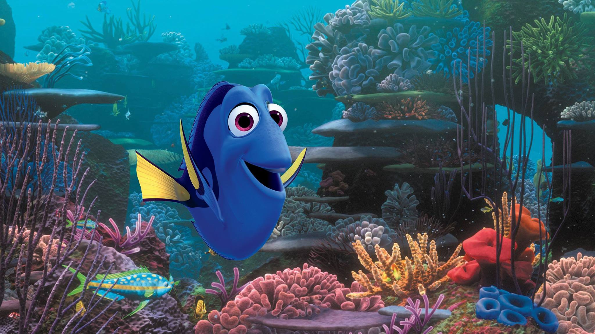

Every Pixar franchise has an underlying theme that goes beyond what we initially think it will be about. As much as we like the idea of our toys coming to life when we’re not in our bedrooms, _Toy Story_ showed us our own Holden Caulfield-esque fear of growing up. _WALL-E_, a film about a semi-sentient janitor robot literally cleaning up the mess that people made on Earth, proved that our laziness _does_ drive innovation but warned us that embracing it instead of looking for healthier sources of inspiration will be our demise. All of Pixar’s films are billed as family-friendly entertainment, but the two that tackled family in the most direct sense are _The Incredibles_ and _Finding Nemo_. The former implied that the uniqueness of each family member can be harnessed to build stronger ties, while the latter, quite surprisingly, acts as a modern day guide to parenting.

In 2003’s _Finding Nemo_, a clownfish named Marlin lost his son Nemo and goes through lengths to, er, find him. Along the way he meets Dory, a blue tang with short-term memory loss, and they swim across the ocean to try to save his son. It’s a pitch perfect buddy adventure and a lesser studio would've made the point of the film as “fishes in your aquariums have feelings too.” But this is Pixar, and who would’ve thought that a film about anthropomorphic fishes will mirror the universal conflict between overprotective parents and their children without vilifying either of them and making its viewers (who were mostly parents and their children) understand both sides. _Finding Dory_, which is Pixar’s best non-Toy Story sequel to date runs on this idea and transcends it.

Dory’s short-term memory loss was played for laughs in _Finding Nemo_. But in _Finding Dory_, it’s the film’s guiding light. The film starts with cute baby Dory being assisted by her parents to do basic things. It may not be resonant at once for every family, and I’ve read too many reviews of the film ignoring this, but to parents who have a child with special needs that first scene and Dory’s flashbacks to that time hold so much power. Dory’s parents Jenny and Charlie pushes Dory to overcome her disability with as much patience and optimism that they can muster. They know that building a protective shell around her will make her feel more isolated than she already is. This idea is not played lightly and is not without darkness, as a pivotal scene shows Jenny crying inside her coral home temporarily allowing a shadow of doubt to engulf her hopes for her child. But in front of Dory, that optimism doesn't falter, and you finally understand why Dory just keeps swimming.

This is in direct contrast to Marlin in the original film where he tries his best to shelter and keep Nemo and his tiny fin away from harm. It’s easy to say that Marlin has a shallow view of things and represents everything that is wrong with parenting. But in a world like ours, where terrorists are bombing concert venues and universities, where people are getting shot at bars for just being who they are, where Presidential candidates are vowing to murder people, and where casual hate speech is spewed out everywhere, who can blame parents like him? It’s one thing to let go of your fear and trust your child to find his way back home, but it’s another to let go of your fear and trust that the world has enough good people to help him on his way.

Which brings us to a less obvious message that the film wants to convey, even if it is staring us in the face, tentacles and all. For all its hints of parenting lessons to be learned, a more important message of _Finding Dory_ is inclusiveness. Although the film could've stopped at giving people with special needs a voice and made it poignant, it went beyond by exploring the different layers of what it means to be included. Is it being friends with someone who looks strikingly different from you? Is it denying your preconceived notions of what is safe and trust a distraught-looking bird to fly you out of the water in a pail? Is it looking past a sea lion's casual bullying of another sea lion and trust that he's trying to help you anyway? Or is it as simple as considering your friends as family too?

In a way, the film's vision needed the refreshing confidence of Disney's 2015 film _Zootopia_. But what _Zootopia_ lacked and what _Finding Dory_ found is the nuance of being "included" to not just be an issue of race, gender, ethnicity, religion, or disability. It's not an issue of being "different" at all. Inclusiveness is a mindset that insists tolerance is not the same as acceptance. It wants us to believe that good is the default human setting. You don't need to know the full backstory of a mean-looking octopus before trusting him. Of course there will still be angry giant squids in the depths of the sea that want to harm us along the way. But there will also be that misanthropic octopus (I mean septopus), a totally cool tortoise and his equally cool son, a near-sighted whale shark, an echolocating beluga, bully sea lions, monosyllabic sea gulls, I have no idea what Becky is but _that_ bird, and even a hopeless romantic clam who will try to help us find our way back home. Good people outnumber bad ones by a mile and yet we tend to forget that and let fear take over. We've been accustomed to stories with one-dimensional villains, forgetting that we don't even need one to make a story compelling.

With tragic events filling our newspapers and news feeds everyday, and hate seemingly reigning everywhere, and some people having the gall to use that hate to fuel their personal agendas, it's calming to sit in a cinema sobbing next to a 10-year-old kid and his dad, watching complete fish strangers help a blue tang they barely know get reunited with her parents. If we could just have the same faith in people again, maybe it will be easier to remember (probably in slow motion) that it is indeed a wonderful world.
