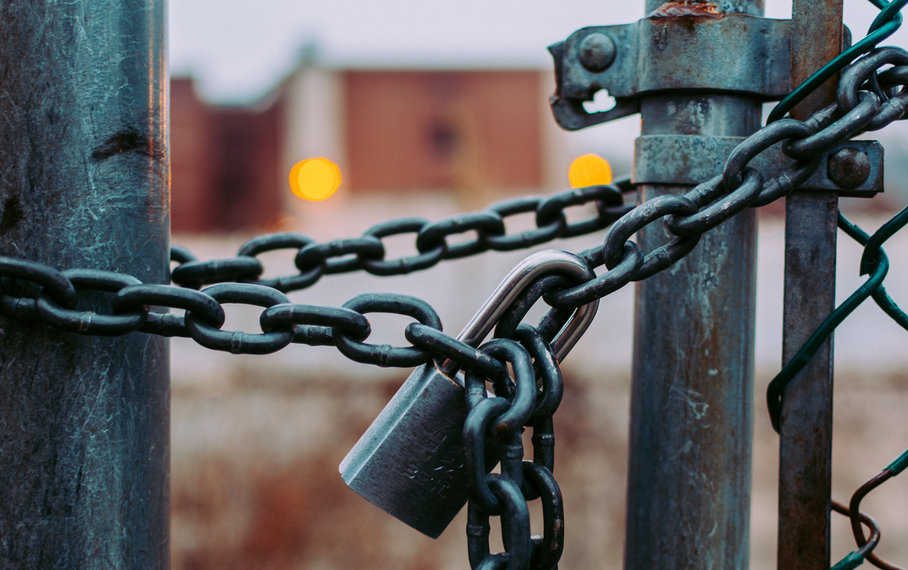
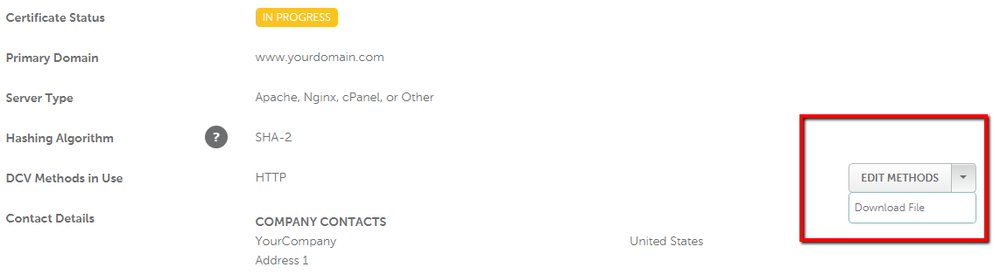
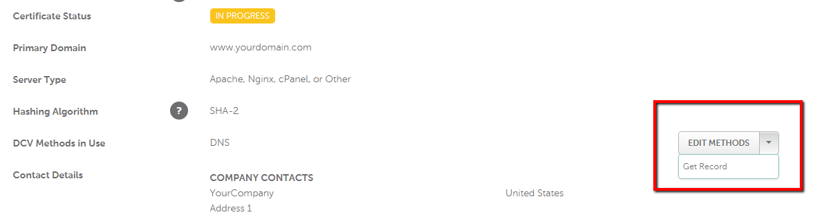
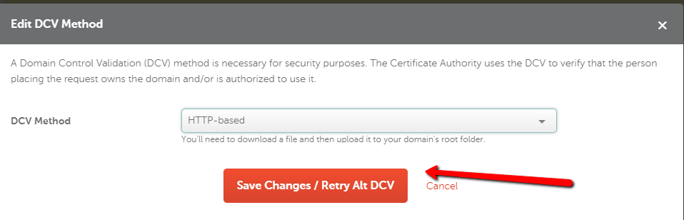
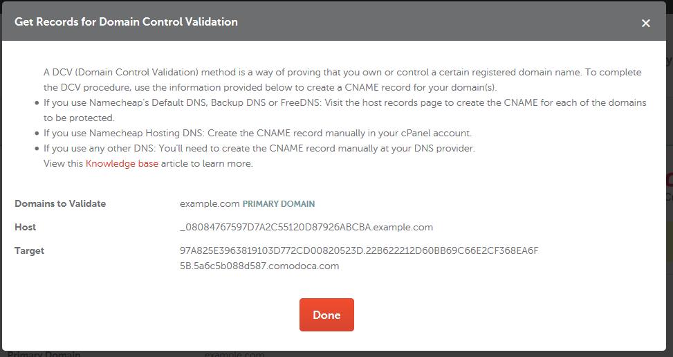

> Note: If you intend to use Netlify (which I eventually did) to deploy your static website, you don’t need this. Netlify can provide a free SSL/TLS certificate via [Let’s Encrypt](https://letsencrypt.org) for your custom domain automatically.  

If you’re like me and you bought your custom domain from Namecheap years ago and never bothered to secure it with an SSL certificate then you will probably encounter this problem when you _do_ try to buy one.  To save you an hour of talking to their customer service (who are pretty helpful by the way), here are the steps you need to take.

## 1. Buy an SSL Certificate
Namecheap provides an easy way to buy an SSL from Sectigo (formerly known as Comodo) through its SSL store. But going there without knowing anything about SSL can be quite overwhelming. It gives you a lot of choices when you really just want to add that precious *https* to your website. Here’s the short version:
- Buy the cheapest one called _Positive SSL_ if you only need to secure one domain (i.e. yourdomain.com and www.yourdomain.com)
- Buy _Positive SSL Wildcard_ if you’re going to use other subdomains  (e.g. blog.yourdomain.com, mail.yourdomain.com, etc.)
- Buy _Essential SSL_ or _Essential SSL Wildcard_ if you’re going to use your domain for a website that deals with some sensitive information (e.g. if you're going to sell things which requires credit card numbers)

## 2. Create a Certificate Signing Request
A certificate signing request (CSR) is what you send to a certificate authority (in this case, Sectigo) to apply for a digital identity certificate. The digital identity certificate is what you need to prove your ownership of a domain. As an analogy, think of CSR as your passport application and the digital identity certificate as your actual passport. If this seems like a lot of jargon that you don’t need, don’t be scared, because it’s as easy a filling up a [form](https://decoder.link/csr_generator). Everything will be generated for you.

## 3. Submit the CSR and choose a Domain Control Validation (DCV) method
After submitting the CSR, it’s in the name that you’ve only sent a _request_.  So the certificate you just bought and your domain are not linked yet. They don’t know about each other even though you bought both of them from Namecheap. The CSR that you submitted can only be validated by the certificate authority if you can prove that the domain is actually yours. There are three ways that you can do this:

1. **Email validation** - This is pretty easy to understand because we’ve all done “verify your email address” at some point. The catch is you can only do this if you have a domain related generic email. Your Gmail account that ends with @gmail.com will not work. Some of the generic emails allowed for this method are: 
    - admin@yourdomain.com
    - administrator@yourdomain.com
    - postmaster@yourdomain.com
    - webmaster@yourdomain.com
    - hostmaster@yourdomain.com. 

2. **HTTP-based validation** - This involves downloading a file and adding it to the following directory of your site: **/.well-known/pki-validation/**. Here’s how you get the file:



3. **DNS-based validation** - This involves fiddling with your DNS settings under **Domain List > Manage > Advanced DNS** by adding a CNAME and a CAA Record.  Here’s how you get the values to enter:



After configuring any of these methods, you should force retry the DCV to let the certificate authority know that your domain is ready.




## 4. Debugging DNS-based validation
If you chose either email or HTTP-based validation for DCV, then those should be straightforward. Your digital identity certificate will be emailed to you and you can start using it for your website. But if you chose DNS-based validation like me you might run into the same problems that I did.

If you already have your DNS settings set to point to your website, for example you’re using it to point to [GitHub Pages](https://help.github.com/en/articles/setting-up-an-apex-domain), then you will have an A record of `185.199.108.153` and a CNAME record of `<githubusername>.github.io`. Here’s where the trouble starts. You can’t have an existing CNAME record because it clashes with the record that the certificate authority needs.

So before trying to execute DCV, remove the existing CNAME record and replace it with the record provided to you in the certificate enrollment page. Here’s an example:



For the **host**, you should drop the domain even when Namecheap shows it in the value. So for the example above, the CNAME record would have these values:

```
Type: CNAME
Host: _08084767597DA2C55120D87926ABCBA
Target: 97A825E3963819103D772CD00820523D.22B622212D60BB69C66E2CF368EA6F5B.5a6c6b088d587.comodoca.com
TTL: Automatic
```

Additionally, it’s not mentioned anywhere in the documentation but you will also need to add a CAA record as follows:

```
Type: CAA
Host: www
Target: issue 0 comodoca.com
TTL: Automatic
```

After this configuration, retry the DCV by clicking the same **Retry Alt DCV** button from Step #3. The validation should be successful and you will get an email with your SSL certificate attached.

For further questions, contact the [Namecheap live chat support](https://www.namecheap.com/support/live-chat/domains/).

## References
- [AboutSSL: Comodo Positive SSL vs Essential SSL](https://aboutssl.org/compare-dv-ssl-comodo-positive-ssl-vs-comodo-essential-ssl/)
- [Namcheap: How can I complete DVC for my SSL certificate?](https://www.namecheap.com/support/knowledgebase/article.aspx/9637/68/how-can-i-complete-the-domain-control-validation-dcv-for-my-ssl-certificate)